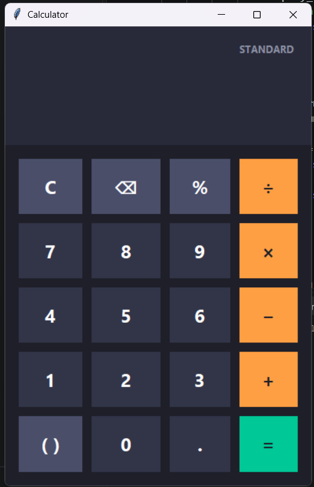

# Python Calculator

A simple, modern-looking GUI calculator built using Python and Tkinter.

## Screenshot




## Features

- Addition, subtraction, multiplication, division
- Decimal calculations
- Percentage
- Parentheses
- Backspace (⌫) and clear (C)
- Full keyboard support (numbers, operators, Enter, Backspace, Escape)
- Modern dark-themed interface with color-coded buttons:
  - **Orange** — operators (÷ × − +)
  - **Teal/Green** — equals (=)
  - **Slate** — functions (C, ⌫, %, parentheses)
  - **Dark blue-gray** — numbers
- Hover effects on all buttons
- Responsive layout that resizes with the window

## Technologies Used

- Python 3
- Tkinter (built into Python's standard library — no extra installs needed)

## How to Run

1. Make sure Python 3 is installed on your machine.
2. Open this folder in VS Code (or your terminal).
3. Run:

```bash
python main.py
```

> On some systems you may need to use `python3 main.py` instead.

## Project Structure

```
python-calculator/
├── main.py      # Calculator logic and GUI
├── README.md    # Project documentation
└── image/       # Screenshot(s)
```

## Notes

- No external dependencies are required — Tkinter ships with standard Python installations on Windows and macOS. On some Linux distributions you may need to install it separately, e.g.:

```bash
sudo apt-get install python3-tk
```
